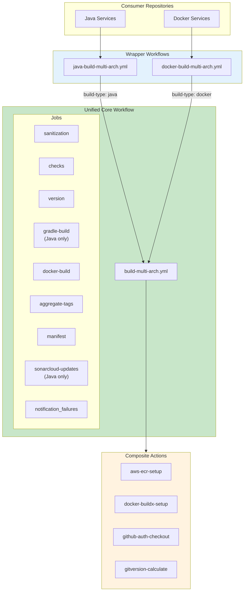
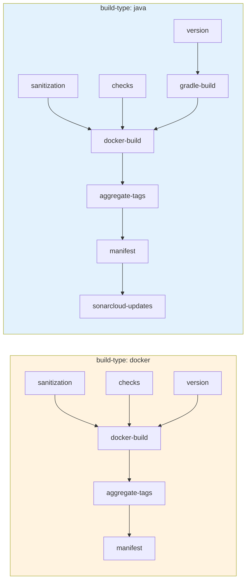
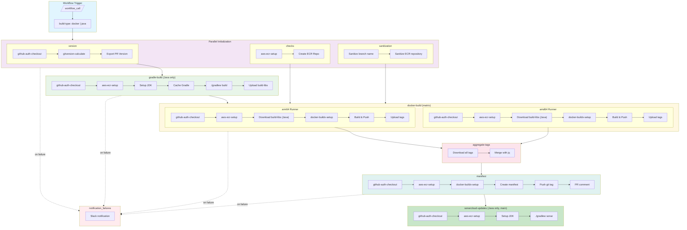
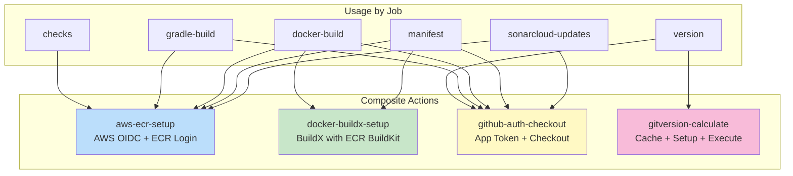
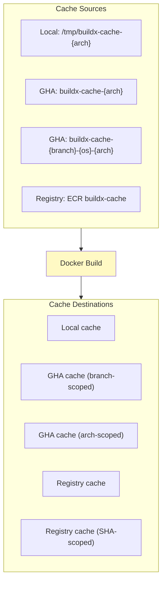
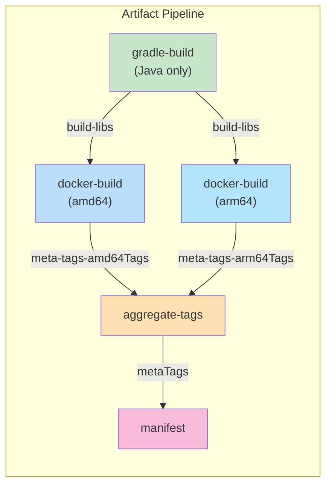

# Unified Multi-Arch Build Pipeline Diagram

## Overview

The `build-multi-arch.yml` is the **core unified workflow** that powers all multi-architecture Docker builds. It uses a `build-type` input to conditionally enable Java-specific jobs while sharing all common build logic.

## Architecture



## Build Type Comparison

The `build-type` input determines which jobs are executed:



| Job | build-type: docker | build-type: java |
| --- | ------------------ | ---------------- |
| sanitization | Executed | Executed |
| checks | Executed | Executed |
| version | Executed | Executed |
| gradle-build | **Skipped** | Executed |
| docker-build | Executed | Executed (depends on gradle-build) |
| aggregate-tags | Executed | Executed |
| manifest | Executed | Executed |
| sonarcloud-updates | **Skipped** | Executed (main branch only) |
| notification_failures | On failure | On failure |

## Complete Job Flow



## Composite Actions Integration

The unified workflow leverages four composite actions for DRY code:



## Key Inputs

| Input | Type | Required | Description |
| ----- | ---- | -------- | ----------- |
| `build-type` | string | **Yes** | `docker` or `java` |
| `aws-account-id` | string | No | AWS Account ID |
| `aws-region` | string | No | AWS Region |
| `ecr-repository` | string | No | ECR repository name |
| `dockerfile-path` | string | No | Path to Dockerfile |
| `context` | string | No | Docker build context |
| `jdk-version` | number | Java only | JDK version |
| `jdk-distribution` | string | No | JDK distribution |
| `uses-sonar` | boolean | No | Enable SonarCloud |
| `push` | string | No | Push image after build |

## Outputs

| Output | Description |
| ------ | ----------- |
| `version` | Major.Minor.Patch version |
| `semVer` | Full semantic version |
| `shortSha` | Short commit SHA |

## Conditional Job Logic

### gradle-build Job

```yaml
gradle-build:
  if: ${{ inputs.build-type == 'java' && success() && !contains(...) }}
```

Only runs when `build-type: java`.

### docker-build Job

```yaml
docker-build:
  needs: [sanitization, checks, version, gradle-build]
  if: |
    always() &&
    needs.sanitization.result == 'success' &&
    needs.checks.result == 'success' &&
    needs.version.result == 'success' &&
    (inputs.build-type == 'docker' || needs.gradle-build.result == 'success')
```

Handles both build types by checking if gradle-build was needed.

### sonarcloud-updates Job

```yaml
sonarcloud-updates:
  if: |
    inputs.build-type == 'java' &&
    success() &&
    github.ref_name == github.event.repository.default_branch
```

Only runs for Java builds on the main branch.

## Docker Caching Strategy



## Artifact Flow



## Benefits of Unified Architecture

1. **Single Source of Truth**: All build logic in one workflow
2. **DRY Principle**: No duplicated code between Java and Docker builds
3. **Consistent Behavior**: Same caching, tagging, and manifest creation
4. **Easy Maintenance**: Fix once, apply everywhere
5. **Backward Compatibility**: Wrapper workflows maintain original APIs
6. **Extensibility**: Easy to add new build types (Node.js, Python, etc.)

## Adding New Build Types

To add a new build type (e.g., `nodejs`):

1. Add new conditional job(s) in `build-multi-arch.yml`
2. Create wrapper workflow `nodejs-build-multi-arch.yml`
3. Pass `build-type: nodejs` to the unified workflow

```yaml
# nodejs-build-multi-arch.yml (example)
jobs:
  build:
    uses: ./.github/workflows/build-multi-arch.yml
    with:
      build-type: nodejs
      node-version: 20
    secrets: inherit
```
