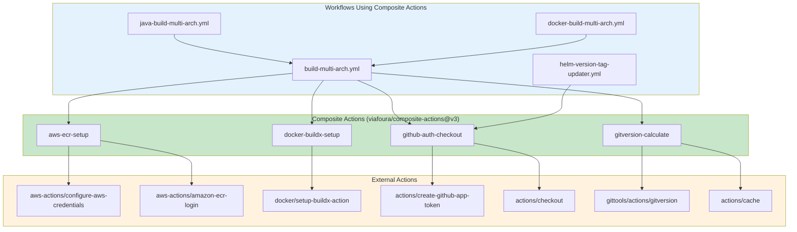
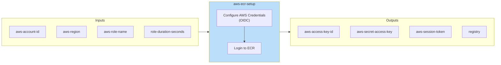
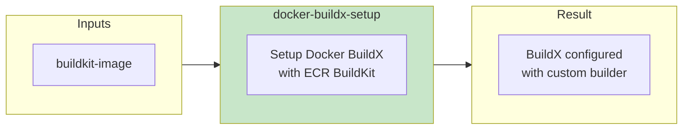
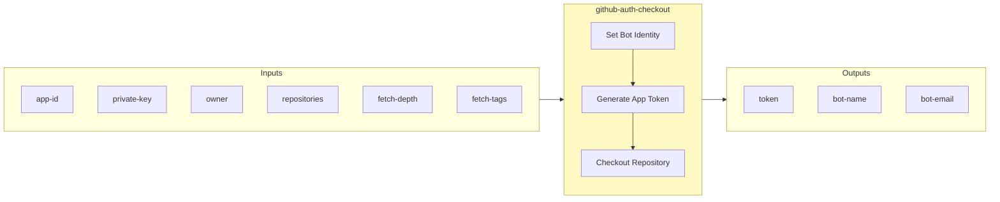
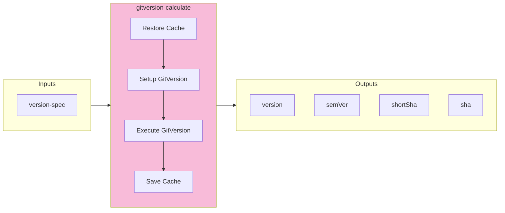
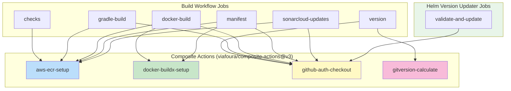
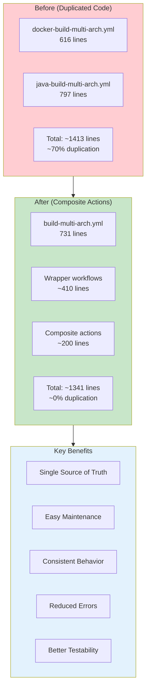

# Composite Actions Documentation

## Overview

This repository uses composite actions from [viafoura/composite-actions@v3](https://github.com/viafoura/composite-actions) that encapsulate common CI/CD patterns used across all build workflows. These actions follow the DRY principle and provide a single source of truth for shared functionality.

> **Note:** The composite actions have been migrated from `.github/actions/` in this repository to the centralized `viafoura/composite-actions` repository and are now available at version `v3`.

## Architecture



## Action Details

### 1. aws-ecr-setup

Configures AWS credentials using OIDC and logs into Amazon ECR.



#### Inputs

| Input | Required | Default | Description |
| ----- | -------- | ------- | ----------- |
| `aws-account-id` | Yes | - | AWS Account ID |
| `aws-region` | No | `us-east-1` | AWS Region |
| `aws-role-name` | No | `github-actions-role` | IAM role name for OIDC |
| `role-duration-seconds` | No | `1800` | Role session duration |

#### Outputs

| Output | Description |
| ------ | ----------- |
| `aws-access-key-id` | AWS Access Key ID |
| `aws-secret-access-key` | AWS Secret Access Key |
| `aws-session-token` | AWS Session Token |
| `registry` | ECR Registry URL |

#### Usage Example

```yaml
- name: Setup AWS and ECR
  uses: elioetibr/composite-actions/.github/actions/aws-ecr-setup@main
  with:
    aws-account-id: ${{ vars.AWS_CICD_ACCOUNT_ID }}
    aws-region: ${{ vars.AWS_REGION }}
    aws-role-name: github-actions-role
```

---

### 2. docker-buildx-setup

Configures Docker BuildX with an ECR-hosted BuildKit image for improved performance.



#### Inputs

| Input | Required | Default | Description |
| ----- | -------- | ------- | ----------- |
| `buildkit-image` | No | ECR mirror | Docker BuildKit image URL |

#### Usage Example

```yaml
- name: Setup Docker BuildX
  uses: elioetibr/composite-actions/.github/actions/docker-buildx-setup@main
  with:
    buildkit-image: ${{ vars.AWS_CICD_ACCOUNT_ID }}.dkr.ecr.${{ vars.AWS_REGION }}.amazonaws.com/moby/buildkit:buildx-stable-1
```

---

### 3. github-auth-checkout

Generates a GitHub App token and checks out the repository with proper authentication.



#### Inputs

| Input | Required | Default | Description |
| ----- | -------- | ------- | ----------- |
| `app-id` | Yes | - | GitHub App ID |
| `private-key` | Yes | - | GitHub App private key |
| `owner` | No | Current owner | Repository owner |
| `repositories` | No | Current repo | Comma-separated repository list |
| `fetch-depth` | No | `0` | Git fetch depth |
| `fetch-tags` | No | `true` | Whether to fetch tags |

#### Outputs

| Output | Description |
| ------ | ----------- |
| `token` | Generated GitHub App token |
| `bot-name` | Bot username for commits |
| `bot-email` | Bot email for commits |

#### Usage Example

```yaml
- name: Checkout with Auth
  id: checkout
  uses: elioetibr/composite-actions/.github/actions/github-auth-checkout@main
  with:
    app-id: ${{ vars.GH_APP_ID }}
    private-key: ${{ secrets.PRIVATE_KEY }}
    fetch-depth: 0
    fetch-tags: true

- name: Use Token
  run: |
    git config user.name "${{ steps.checkout.outputs.bot-name }}"
    git config user.email "${{ steps.checkout.outputs.bot-email }}"
```

---

### 4. gitversion-calculate

Calculates semantic version using GitVersion with caching for improved performance.



#### Inputs

| Input | Required | Default | Description |
| ----- | -------- | ------- | ----------- |
| `version-spec` | No | `5.x` | GitVersion version specification |

#### Outputs

| Output | Description |
| ------ | ----------- |
| `version` | Major.Minor.Patch version (e.g., `1.2.3`) |
| `semVer` | Full semantic version (e.g., `1.2.3-alpha.1`) |
| `shortSha` | Short commit SHA (e.g., `abc1234`) |
| `sha` | Full commit SHA |

#### Usage Example

```yaml
- name: Calculate Version
  id: version
  uses: elioetibr/composite-actions/.github/actions/gitversion-calculate@main
  with:
    version-spec: '5.x'

- name: Use Version
  run: |
    echo "Version: ${{ steps.version.outputs.version }}"
    echo "SemVer: ${{ steps.version.outputs.semVer }}"
    echo "Short SHA: ${{ steps.version.outputs.shortSha }}"
```

---

## Usage by Job

The following diagram shows which jobs use which composite actions:



## Action Usage Matrix

### Build Workflows (build-multi-arch.yml)

| Job | aws-ecr-setup | docker-buildx-setup | github-auth-checkout | gitversion-calculate |
| --- | :-----------: | :-----------------: | :------------------: | :------------------: |
| checks | ✅ | - | - | - |
| version | - | - | ✅ | ✅ |
| gradle-build | ✅ | - | ✅ | - |
| docker-build | ✅ | ✅ | ✅ | - |
| manifest | ✅ | ✅ | ✅ | - |
| sonarcloud-updates | ✅ | - | ✅ | - |

### Other Workflows

| Workflow | aws-ecr-setup | docker-buildx-setup | github-auth-checkout | gitversion-calculate |
| -------- | :-----------: | :-----------------: | :------------------: | :------------------: |
| helm-version-tag-updater | - | - | ✅ | - |

## Benefits of Composite Actions



### Summary

| Metric | Before | After | Improvement |
| ------ | ------ | ----- | ----------- |
| AWS/ECR setup code | 6 copies | 1 action | 83% reduction |
| Docker BuildX setup | 4 copies | 1 action | 75% reduction |
| GitHub auth/checkout | 7+ copies | 1 action | 86% reduction |
| GitVersion setup | 2 copies | 1 action | 50% reduction |
| Total duplication | ~70% | ~0% | 70% reduction |

## File Structure

```text
.github/
└── workflows/
    ├── build-multi-arch.yml         # Unified core workflow
    ├── docker-build-multi-arch.yml  # Docker wrapper
    ├── java-build-multi-arch.yml    # Java wrapper
    └── helm-version-tag-updater.yml # Helm version updater
```

The composite actions are now hosted in [viafoura/composite-actions@v3](https://github.com/viafoura/composite-actions):

- `elioetibr/composite-actions/.github/actions/aws-ecr-setup@main` - AWS OIDC + ECR login
- `elioetibr/composite-actions/.github/actions/docker-buildx-setup@main` - Docker BuildX configuration
- `elioetibr/composite-actions/.github/actions/github-auth-checkout@main` - GitHub App auth + checkout
- `elioetibr/composite-actions/.github/actions/gitversion-calculate@main` - GitVersion with caching

## Contributing

When modifying composite actions:

1. **Test Changes**: Ensure changes work with both `docker` and `java` build types
2. **Backward Compatibility**: Maintain existing input/output interfaces
3. **Documentation**: Update this file with any new inputs/outputs
4. **Version Pinning**: Pin external action versions for reproducibility
