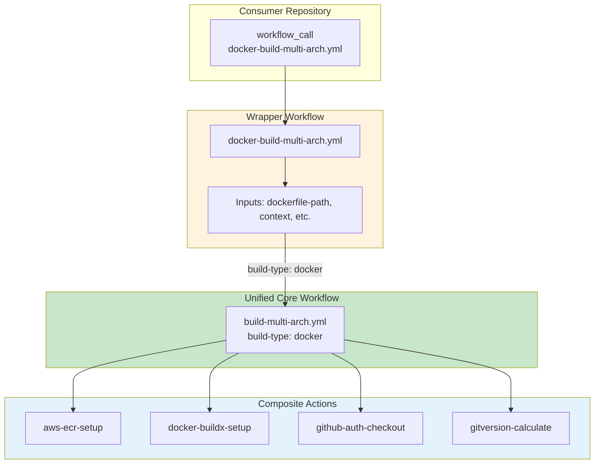
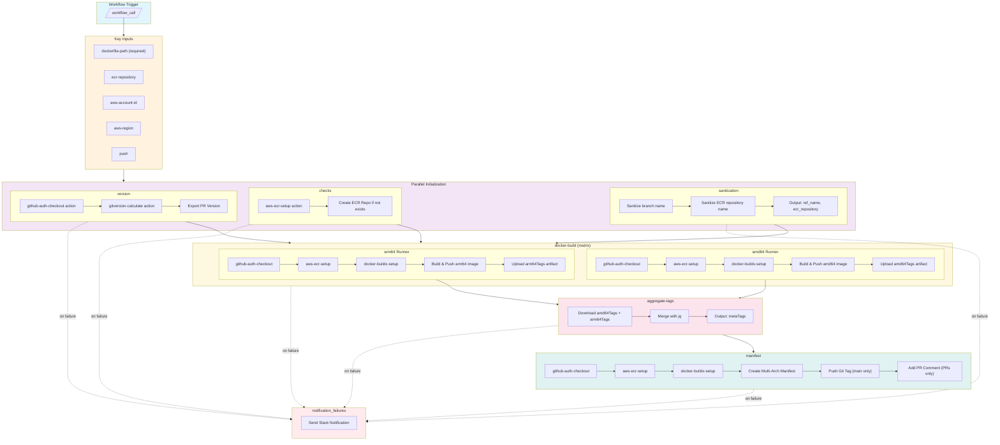
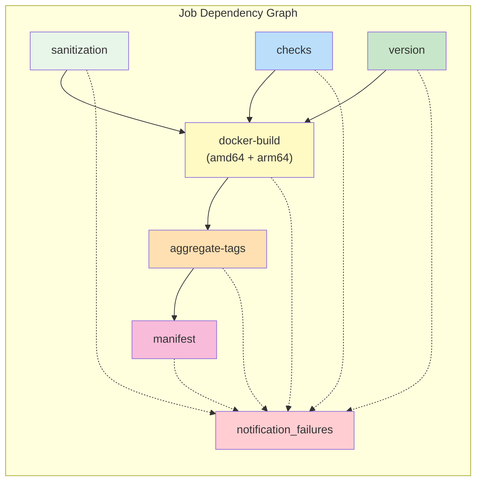
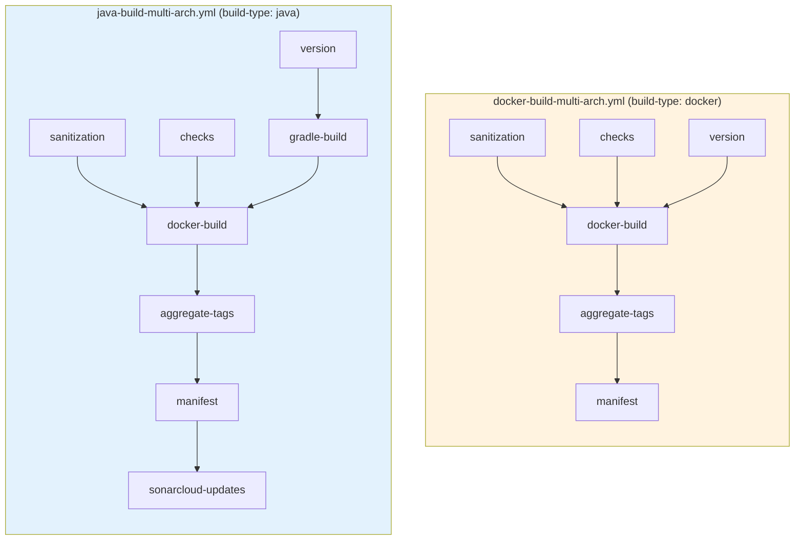
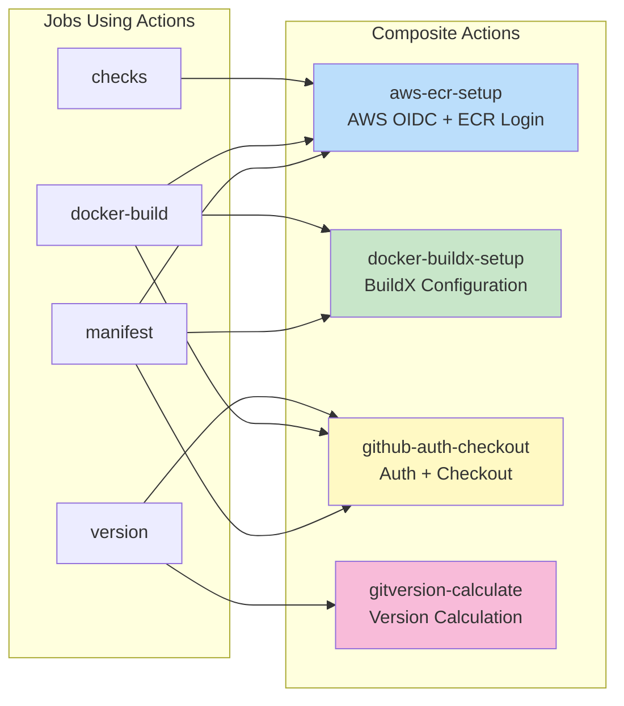
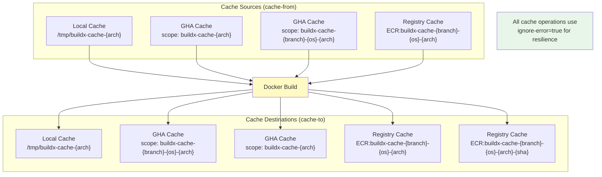

# Docker Multi-Arch Build Workflow Diagram

## Overview

The `docker-build-multi-arch.yml` is a **wrapper workflow** that provides backward compatibility for Docker-only builds. It calls the unified `build-multi-arch.yml` workflow with `build-type: docker`.

## Workflow Architecture



## Job Flow (via Unified Workflow)

When `build-type: docker` is passed to the unified workflow, the following jobs are executed:



## Job Dependencies



## Comparison: Docker vs Java Build



## Key Differences from Java Build

| Feature | docker-build-multi-arch | java-build-multi-arch |
| ------- | ----------------------- | --------------------- |
| Build Type | `docker` | `java` |
| Gradle Build | Skipped | Executed |
| Build Artifacts | Docker context only | JAR files from Gradle |
| SonarCloud Updates | Skipped | Executed (main branch) |
| Use Case | Generic Docker builds | Java applications |

## Inputs Reference

| Input | Type | Required | Default | Description |
| ----- | ---- | -------- | ------- | ----------- |
| `dockerfile-path` | string | Yes | `./Dockerfile` | Path to Dockerfile |
| `context` | string | No | `.` | Docker build context |
| `ecr-repository` | string | No | Repository name | ECR repository name |
| `aws-account-id` | string | No | `vars.AWS_CICD_ACCOUNT_ID` | AWS Account ID |
| `aws-region` | string | No | `vars.AWS_REGION` | AWS Region |
| `push` | string | No | `vars.DOCKER_BUILD_PUSH` | Push image after build |
| `provenance` | string | No | `vars.DOCKER_BUILD_PROVENANCE` | Enable SLSA provenance |
| `runsOnDefault` | string | No | `ubuntu-latest` | Default runner |
| `runsOnAmd64` | string | No | `vars.RUNS_ON_GHA_AMD64` | AMD64 runner |
| `runsOnArm64` | string | No | `vars.RUNS_ON_GHA_ARM64` | ARM64 runner |

## Secrets Reference

| Secret | Required | Description |
| ------ | -------- | ----------- |
| `PRIVATE_KEY` | Yes | GitHub App private key |
| `SLACK_BOT_TOKEN` | No | Slack bot token for notifications |
| `SONAR_TOKEN` | No | SonarCloud token (passed to Docker build) |

## Composite Actions Used

The workflow leverages these composite actions for DRY code:



## Docker Caching Strategy



## Usage Example

```yaml
name: CI

on:
  pull_request:
    types: [opened, synchronize, reopened]
  push:
    branches: ['**']
    tags-ignore: ['**']
  workflow_dispatch:

concurrency:
  group: ${{ github.event.repository.name }}-${{ github.event_name }}-${{ github.event.pull_request.number || github.ref_name }}-${{ github.sha }}
  cancel-in-progress: ${{ github.ref_name != github.event.repository.default_branch }}

jobs:
  build:
    uses: elioetibr/composite-actions/.github/workflows/docker-build-multi-arch.yml@main
    with:
      dockerfile-path: ./Dockerfile
      ecr-repository: ${{ github.event.repository.name }}
    secrets: inherit
```
