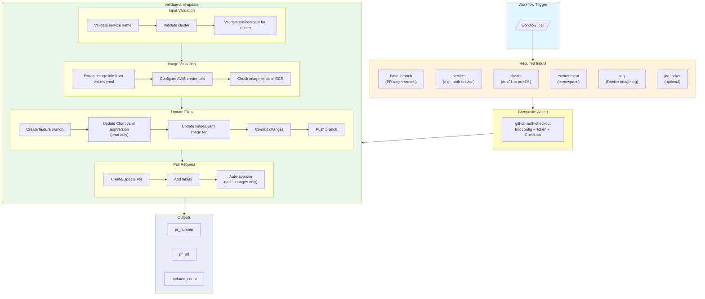
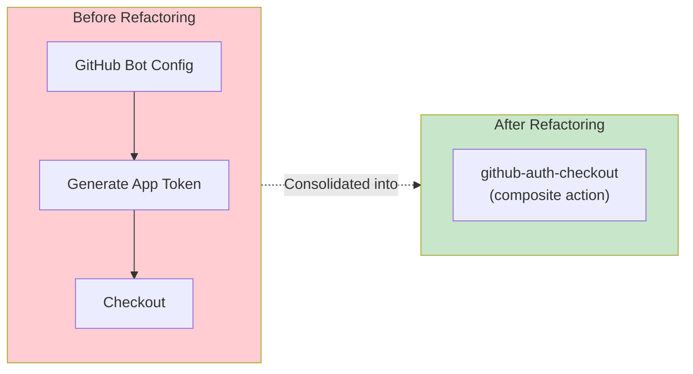
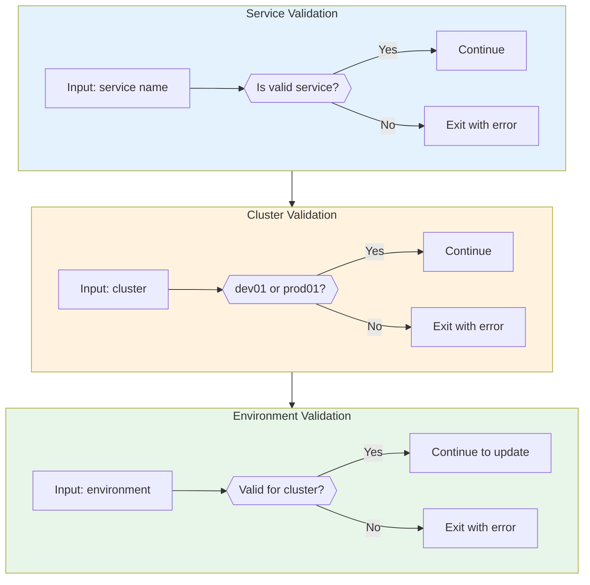
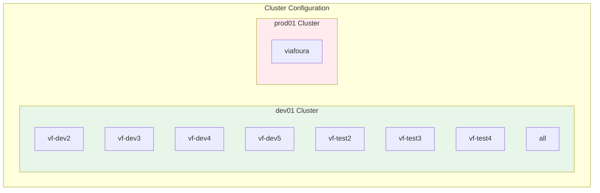
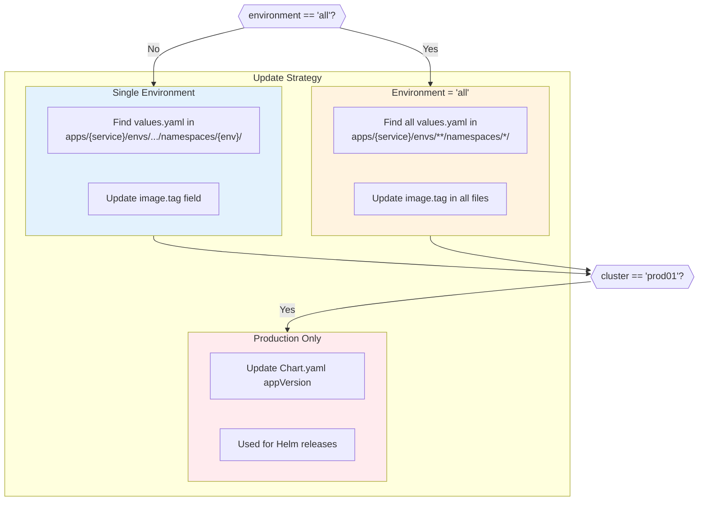
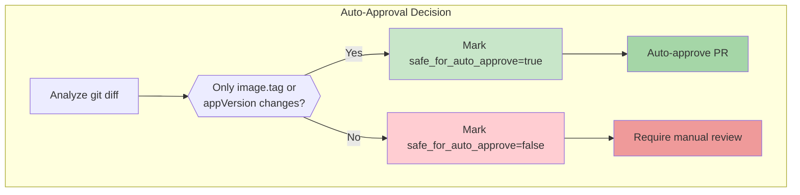
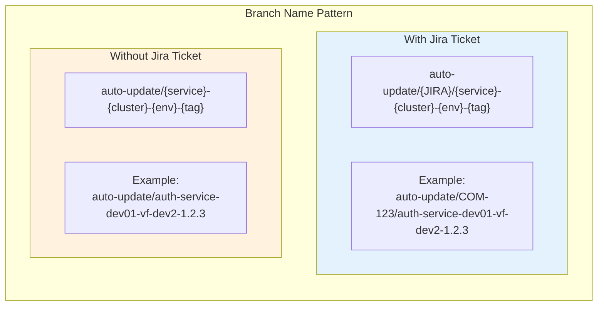
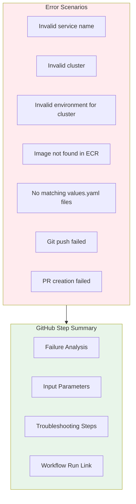

# Helm Charts Version Tag Updater Workflow

## Workflow Overview

This workflow automates the process of updating Docker image tags in Helm chart repositories. It validates inputs, checks that images exist in ECR, updates values.yaml files, creates PRs, and auto-approves safe changes.

**Uses Composite Action:** `github-auth-checkout` for GitHub authentication and repository checkout.



## Composite Action Integration

This workflow uses the `github-auth-checkout` composite action to consolidate:

1. **GitHub Bot Configuration** - Sets up bot identity for commits
2. **GitHub App Token Generation** - Creates authentication token
3. **Repository Checkout** - Clones the repository with proper auth



## Validation Flow



## Valid Environments by Cluster



## File Update Strategy



## Auto-Approval Logic



## Branch Naming Convention



## Inputs Reference

| Input | Type | Required | Description |
|-------|------|----------|-------------|
| `base_branch` | string | Yes | Target branch for the PR |
| `service` | string | Yes | Service name (must be valid) |
| `cluster` | string | Yes | Cluster name (`dev01` or `prod01`) |
| `environment` | string | Yes | Namespace/environment |
| `tag` | string | Yes | Docker image tag to deploy |
| `jira_ticket` | string | No | Jira ticket for tracking |

## Valid Services

```
auth-service, auth0-oidc-demo, cassandra, comment-import,
common-external-services, console, console-moderation,
console-opensearch, data-burrito, email, flume, gdpr-mediation,
heimdall, ingestor, java-vertx-template, legacy-gdpr-connector,
livechat, livecomments, livequestions, livereviews, livestories,
moderation-orchestrator, polls, realtime-event-feed, spam-moderation,
tyrion, ucs-moderation, user-import, user-interaction,
user-notification, viafoura-front, webhooks, webhooks-client
```

## Outputs Reference

| Output | Description |
|--------|-------------|
| `pr_number` | The PR number created |
| `pr_url` | The PR URL created |
| `updated_count` | Number of files updated |

## Usage Example

```yaml
name: Deploy to Dev

on:
  workflow_dispatch:
    inputs:
      tag:
        description: 'Docker image tag'
        required: true
      environment:
        description: 'Environment'
        required: true
        type: choice
        options:
          - vf-dev2
          - vf-dev3
          - vf-dev4
          - vf-dev5
          - all
      jira_ticket:
        description: 'Jira ticket (optional)'
        required: false

jobs:
  update-version:
    uses: elioetibr/composite-actions/.github/workflows/apps-of-apps-application-version-update.yml@main
    with:
      base_branch: main
      service: my-service
      cluster: dev01
      environment: ${{ github.event.inputs.environment }}
      tag: ${{ github.event.inputs.tag }}
      jira_ticket: ${{ github.event.inputs.jira_ticket }}
    secrets:
      PRIVATE_KEY: ${{ secrets.PRIVATE_KEY }}
```

## Error Handling

The workflow provides detailed error summaries in GitHub Actions:


