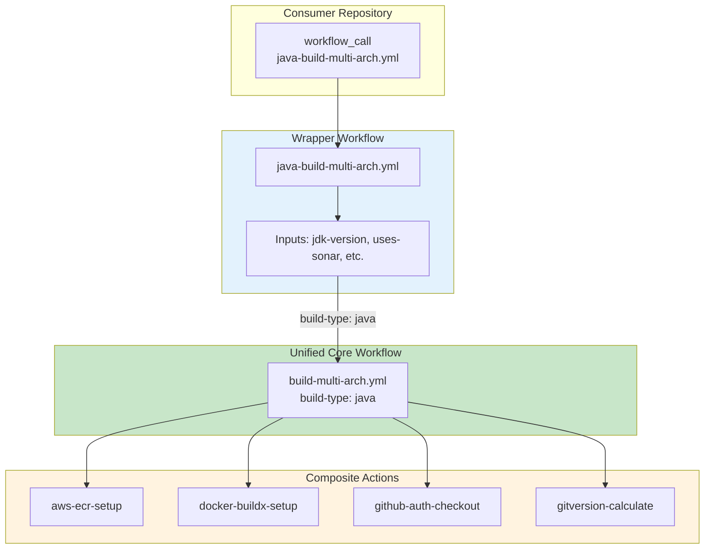
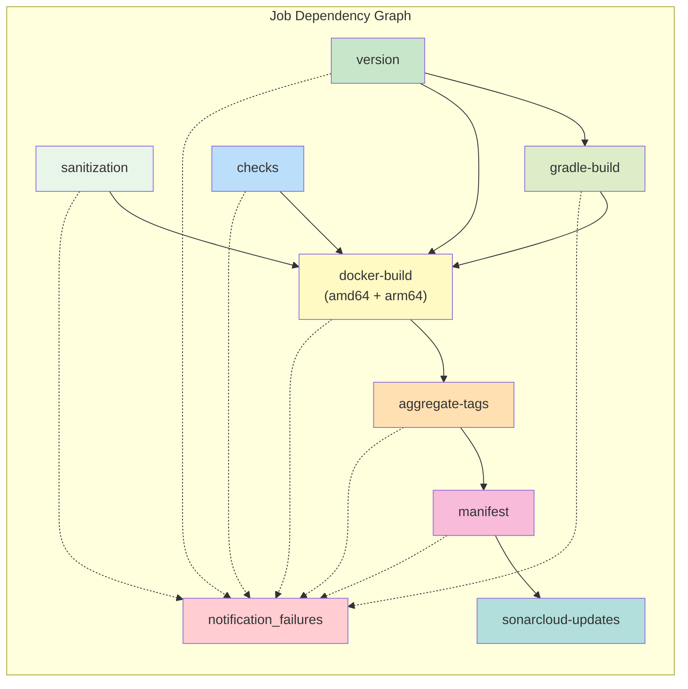
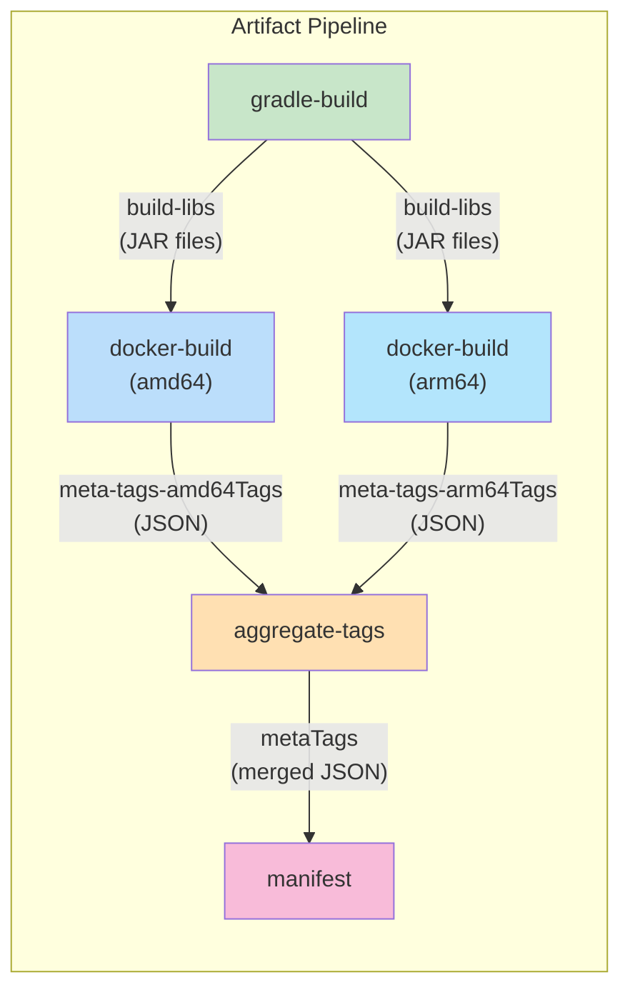
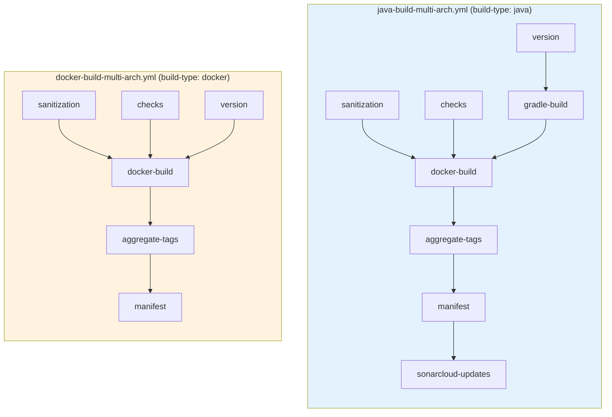
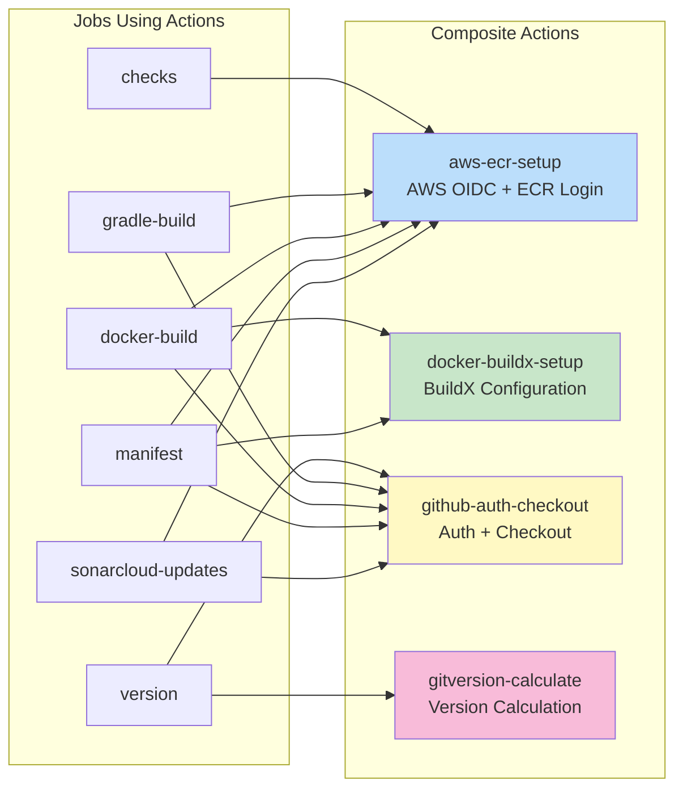
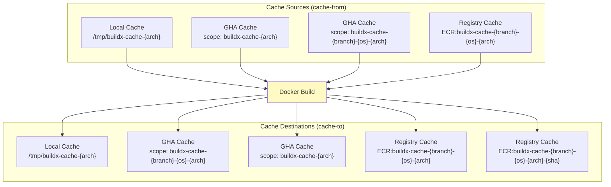
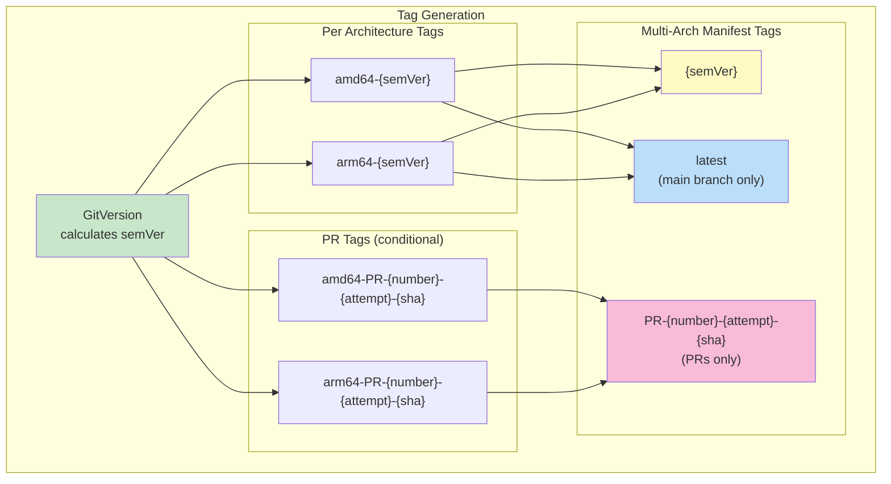
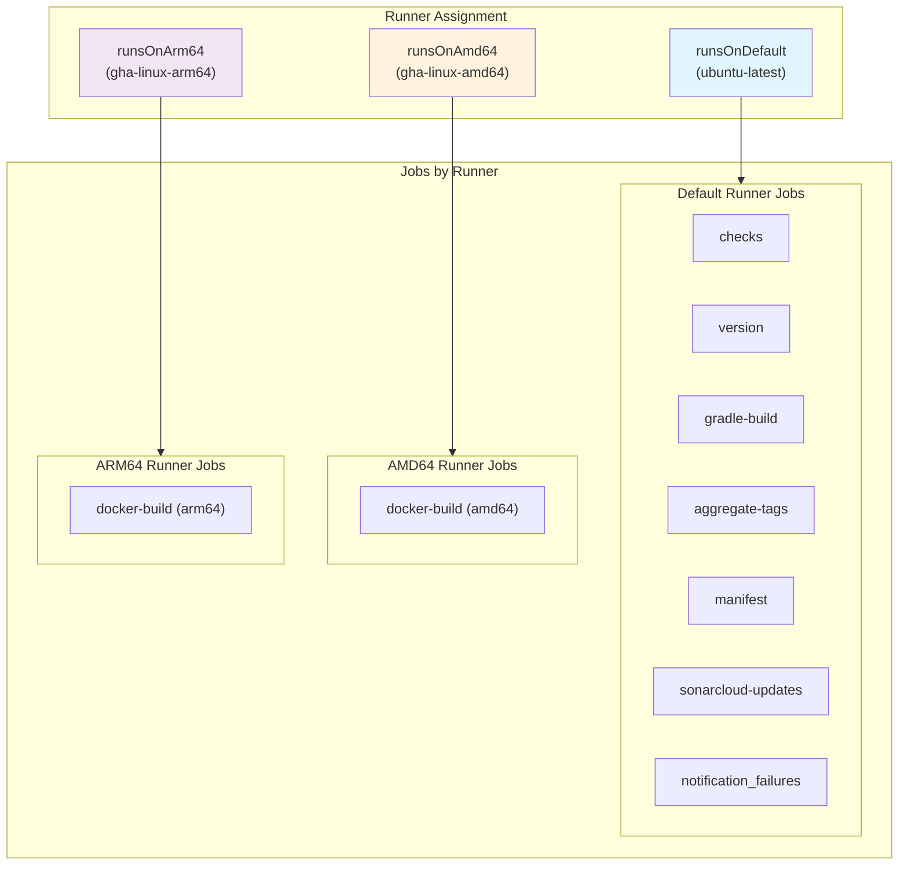

# Java Multi-Arch Build Workflow Diagram

## Overview

The `java-build-multi-arch.yml` is a **wrapper workflow** that provides a complete CI/CD pipeline for Java applications. It calls the unified `build-multi-arch.yml` workflow with `build-type: java`.

## Workflow Architecture



## Job Flow (via Unified Workflow)

When `build-type: java` is passed to the unified workflow, all jobs are executed including Java-specific ones:

```mermaid
flowchart TB
    subgraph trigger["Workflow Trigger"]
        WC[/"workflow_call"/]
    end

    subgraph inputs["Key Inputs"]
        direction LR
        I1["jdk-version (required)"]
        I2["ecr-repository"]
        I3["uses-sonar"]
        I4["uses-editorconfig"]
        I5["jdk-distribution"]
    end

    subgraph parallel_start["Parallel Initialization Jobs"]
        direction LR
        subgraph sanitization_job["sanitization"]
            S1["Sanitize branch name"]
            S2["Sanitize ECR repository name"]
            S3["Output: ref_name, ecr_repository"]
            S1 --> S2 --> S3
        end

        subgraph checks_job["checks"]
            C1["aws-ecr-setup action"]
            C2["Create ECR Repo if not exists"]
            C1 --> C2
        end

        subgraph version_job["version"]
            V1["github-auth-checkout action"]
            V2["gitversion-calculate action"]
            V3["Export PR Version"]
            V1 --> V2 --> V3
        end
    end

    subgraph gradle_job["gradle-build (Java only)"]
        G1["github-auth-checkout"]
        G2["aws-ecr-setup"]
        G3["Setup JDK"]
        G4["Cache Gradle packages"]
        G5["Run ./gradlew build"]
        G6["Optional: SonarCloud analysis"]
        G7["Upload build-libs artifact"]
        G1 --> G2 --> G3 --> G4 --> G5 --> G6 --> G7
    end

    subgraph docker_matrix["docker-build (matrix)"]
        direction TB
        subgraph amd64_build["amd64 Runner"]
            DA1["github-auth-checkout"]
            DA2["aws-ecr-setup"]
            DA3["Download build-libs"]
            DA4["docker-buildx-setup"]
            DA5["Build & Push amd64 image"]
            DA6["Upload amd64Tags artifact"]
            DA1 --> DA2 --> DA3 --> DA4 --> DA5 --> DA6
        end

        subgraph arm64_build["arm64 Runner"]
            DB1["github-auth-checkout"]
            DB2["aws-ecr-setup"]
            DB3["Download build-libs"]
            DB4["docker-buildx-setup"]
            DB5["Build & Push arm64 image"]
            DB6["Upload arm64Tags artifact"]
            DB1 --> DB2 --> DB3 --> DB4 --> DB5 --> DB6
        end
    end

    subgraph aggregate_job["aggregate-tags"]
        AT1["Download amd64Tags + arm64Tags"]
        AT2["Merge with jq"]
        AT3["Output: metaTags"]
        AT1 --> AT2 --> AT3
    end

    subgraph manifest_job["manifest"]
        M1["github-auth-checkout"]
        M2["aws-ecr-setup"]
        M3["docker-buildx-setup"]
        M4["Create Multi-Arch Manifest"]
        M5["Push Git Tag (main only)"]
        M6["Add PR Comment (PRs only)"]
        M1 --> M2 --> M3 --> M4 --> M5 --> M6
    end

    subgraph sonar_job["sonarcloud-updates (Java only, main branch)"]
        SC1["github-auth-checkout"]
        SC2["aws-ecr-setup"]
        SC3["Setup JDK"]
        SC4["Run ./gradlew build sonar"]
        SC1 --> SC2 --> SC3 --> SC4
    end

    subgraph notify_job["notification_failures"]
        N1["Send Slack Notification"]
    end

    subgraph outputs["Outputs"]
        O1["version"]
        O2["semVer"]
        O3["shortSha"]
    end

    WC --> inputs
    inputs --> parallel_start

    sanitization_job --> docker_matrix
    checks_job --> docker_matrix
    version_job --> gradle_job
    gradle_job --> docker_matrix

    amd64_build --> aggregate_job
    arm64_build --> aggregate_job

    aggregate_job --> manifest_job
    manifest_job --> sonar_job
    manifest_job --> outputs

    sanitization_job -.->|on failure| notify_job
    checks_job -.->|on failure| notify_job
    version_job -.->|on failure| notify_job
    gradle_job -.->|on failure| notify_job
    docker_matrix -.->|on failure| notify_job
    aggregate_job -.->|on failure| notify_job
    manifest_job -.->|on failure| notify_job

    style trigger fill:#e1f5fe
    style inputs fill:#fff3e0
    style parallel_start fill:#f3e5f5
    style gradle_job fill:#e8f5e9
    style docker_matrix fill:#fff8e1
    style aggregate_job fill:#fce4ec
    style manifest_job fill:#e0f2f1
    style sonar_job fill:#c8e6c9
    style notify_job fill:#ffebee
    style outputs fill:#e8eaf6
```



## Job Dependencies



## Artifact Flow



## Comparison: Java vs Docker Build



## Key Differences from Docker Build

| Feature | java-build-multi-arch | docker-build-multi-arch |
| ------- | --------------------- | ----------------------- |
| Build Type | `java` | `docker` |
| Gradle Build | Executed | Skipped |
| Build Artifacts | JAR files from Gradle | Docker context only |
| SonarCloud Updates | Executed (main branch) | Skipped |
| Use Case | Java applications | Generic Docker builds |
| JDK Setup | Required input | Not applicable |

## Inputs Reference

| Input | Type | Required | Default | Description |
| ----- | ---- | -------- | ------- | ----------- |
| `jdk-version` | number | **Yes** | - | JDK version (8, 11, 17, 21) |
| `jdk-distribution` | string | No | `corretto` | JDK distribution |
| `context` | string | No | `.` | Docker build context path |
| `file` | string | No | `./Dockerfile` | Path to Dockerfile |
| `ecr-repository` | string | No | Repository name | ECR repository name |
| `uses-sonar` | boolean | No | PR-based | Enable SonarCloud analysis |
| `uses-editorconfig` | boolean | No | `false` | Enable editorconfig validation |
| `upload-artifacts` | boolean | No | `true` | Upload build artifacts |
| `runsOnDefault` | string | No | `ubuntu-latest` | Runner for general jobs |
| `runsOnAmd64` | string | No | `vars.RUNS_ON_GHA_AMD64` | Runner for AMD64 builds |
| `runsOnArm64` | string | No | `vars.RUNS_ON_GHA_ARM64` | Runner for ARM64 builds |

## Secrets Reference

| Secret | Required | Description |
| ------ | -------- | ----------- |
| `PRIVATE_KEY` | Yes | GitHub App private key |
| `SONAR_TOKEN` | Yes | SonarCloud token |
| `SLACK_BOT_TOKEN` | Yes | Slack bot token for notifications |

## Outputs Reference

| Output | Description |
| ------ | ----------- |
| `version` | Version calculated by GitVersion (e.g., `1.2.3`) |
| `semVer` | Full semantic version (e.g., `1.2.3-alpha.1`) |
| `shortSha` | Short commit SHA (e.g., `abc1234`) |

## Composite Actions Used

The workflow leverages these composite actions for DRY code:



## Docker Caching Strategy



## Version Tagging Strategy



## Runner Architecture



## Usage Example

```yaml
name: CI

on:
  pull_request:
    types: [opened, synchronize, reopened]
  push:
    branches: ['**']
    tags-ignore: ['**']
  workflow_dispatch:

concurrency:
  group: ${{ github.event.repository.name }}-${{ github.event_name }}-${{ github.event.pull_request.number || github.ref_name }}-${{ github.sha }}
  cancel-in-progress: ${{ github.ref_name != github.event.repository.default_branch }}

jobs:
  build:
    uses: elioetibr/composite-actions/.github/workflows/java-build-multi-arch.yml@main
    with:
      jdk-version: 21
      ecr-repository: ${{ github.event.repository.name }}
      uses-sonar: true
    secrets: inherit
```
